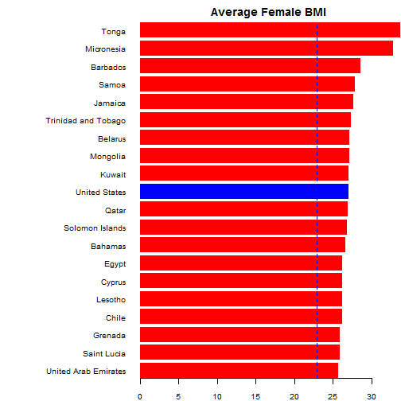

## Idea

1. Compute Body Mass Index using user-defined mass and height
2. Compare computed BMI with country average for selected country and sex
3. Present a graphical representation across all countries in sample

--- .class #id 

## Data

- Country averages are computed by London School of Hygiene & Tropical Medicine and published [here] (http://www.biomedcentral.com/content/pdf/1471-2458-12-439.pdf).

- Actual data are obtained from [Wiki] (http://en.wikipedia.org/wiki/Body_mass_index#Global_statistics)

- Here's a piece of code showing how it was done:

```r
library(XML)
url <- "http://en.wikipedia.org/wiki/Body_mass_index"
table <- readHTMLTable(url)[[7]]
table <- table[, !grepl("Relative|Ratio|Average", names(table))]
table <- table[1:177, ]
names(table) <- c("Country", "Male", "Female")
table$Country <- as.character(table$Country)
table$Male <- as.numeric(as.character(table$Male))
table$Female <- as.numeric(as.character(table$Female))
```

---

## Calculations

* Body Mass Index is computed as $$\frac{mass\,(in\,kg)}{height\,(in\,m)^2}$$
* A server.R function takes user-defined data (country, sex, weight and height), computes BMI and compares it with a country-sex average
* It also draws a bar chart comparing an obtained value with all country averages for a selected sex

---

## Results (only top-20)

Here's an example of how a resulting chart looks for a 70kg heavy and 1.75m tall US woman
 

